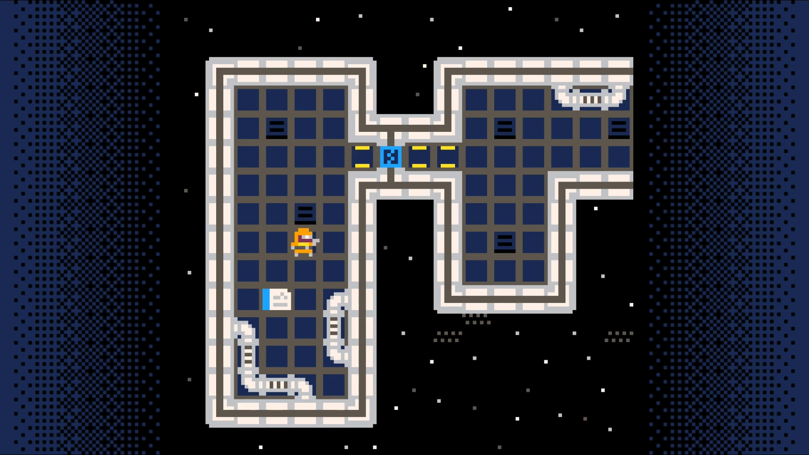

# Adventure Game Tutorial

The content in this subsection comes from the "PICO-8 Top-Down Adventure Game Tutorial by Dylan Bennett.
* [Original youtube playlist](https://www.youtube.com/playlist?list=PLdLmU93eWisKpyk1WZywUSYAq5dkCPFIv) of the tutorial series
* [Official homepage](https://mboffin.itch.io/pico-8-top-down-adventure-game-tutorial) for the tutorial
* Other PICO-8 tutorials from the author.

It is also based on this [write-up](http://www.helianthi.com/pages/pico-8-adventure/) of Dylan's tutorial by John Lehmann.

## Preview

Here is what you will build over the course of this tutorial.

<iframe width="750px" height="680px" src="../step_12/adventuregame_bonus_step_more_tiles.html"></iframe>

## Other Examples

Here are some screenshots of games others have made following this tutorial.

This is a game made by the tutorial's author that is based on the framework built
in the tutorial. It adds a few additional features not covered in the tutorial, but
is a great example of what can be done with this foundation.

<iframe width="750px" height="680px" src="./advent_challah.html"></iframe>

## Other Top-Down Games

These are games that make use of a top-down perspective. Perhaps one of these will
give you inspiration about what you want to include in your game?

Puzzle Cave is a great example of a game successful enough to lead to sequels.
Here's the original. Notice that from a layout design standpoint, this isn't much
more complex than the adventure game tutorial.

<iframe width="750px" height="680px" src="./21104_puzzle_cave_1.html"></iframe>

Sequels usually add more than just additional levels. They often include new item
or enemy types as this one does.

<iframe width="750px" height="680px" src="./21105_puzzle_cave_2.html"></iframe>

The third installment of the game uses a different theme than the other two.

<iframe width="750px" height="680px" src="./40867_puzzle_cave_3.html"></iframe>

Games are often built around a core mechanic. This is a fun little game that
more or less only has the core mechanic. As you play, think about what would
be needed to take this from a concept to a finished product.

<iframe width="750px" height="680px" src="./mellow-2.html"></iframe>

Some games keep you guessing. This one has several surprises just within its
first few moments.

<iframe width="750px" height="680px" src="./47637_null.html"></iframe>

Here's a game that doesn't look much different than the adventure game tutorial,
but it adds an inventory, dialog, the ability to inspect items, etc.

<iframe width="750px" height="680px" src="./41029_kleins_delivery.html"></iframe>

