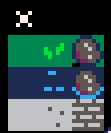
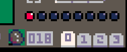
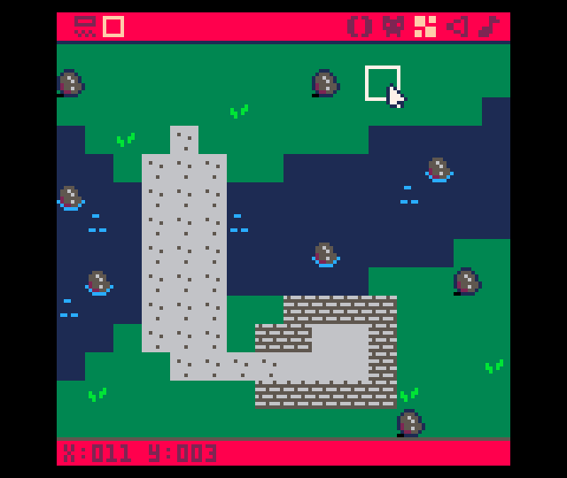
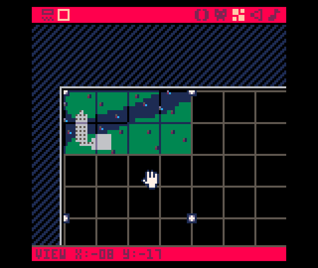

# The Map

<iframe width="560" height="315" src="https://www.youtube.com/embed/J1wvvbVQ5zo" title="YouTube video player" frameborder="0" allow="accelerometer; autoplay; clipboard-write; encrypted-media; gyroscope; picture-in-picture" allowfullscreen></iframe>

Start by going to the sprite editor and drawing nine sprites:
* grass, fancy grass, and rock
* water, fancy water, and water rock
* road, fancy road, and wall

Here's an example of what they might look like:



Toggle sprite flag 0 on the rock, the three water tiles, and the wall sprite.



## Draw a Map
Now that you have some sprites created, lets use them to draw a map for our game.

Head on over to the map tool (third icon from the left in the top bar).



Once you fill the first screen, add another. To do so, you'll need to pan
the map by holding space and dragging with the mouse.

Here's what you might want to put on the second screen.


Here's what the map looks like zoomed out with both screens populated.




## Game Loop
Create the main `game loop`. Put this in the **0** tab of the editor.


```lua
--game loop

function _init()
 map_setup()
end

function _update()
end

function _draw()
 cls()
 draw_map()
end
```

## Map Code
Create code that draws the map. Click the **+** button to create a new tab. Put this code in the **1** tab of the code editor.

```lua
--map code

function map_setup()
 --map tile settings
 wall=0
 key=1
 door=2
 anim1=3
 anim2=4
 lose=6
 win=7
end

function draw_map()
 map(0,0,0,0,128,64)
ends
```

## End Result
<iframe width="750px" height="680px" src="./adventuregame_step_01.html"></iframe>
