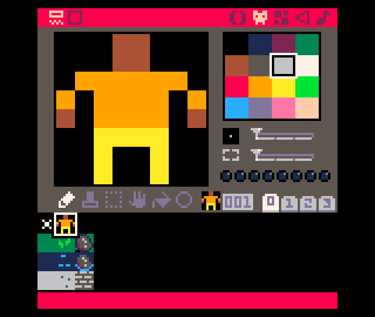

# The Player

<iframe width="560" height="315" src="https://www.youtube.com/embed/cam1jKG1hOY" title="YouTube video player" frameborder="0" allow="accelerometer; autoplay; clipboard-write; encrypted-media; gyroscope; picture-in-picture" allowfullscreen></iframe>

Draw a sprite for the player.



Click on the **+** in the code editor to add a new tab. This will be used for the code related to the player.


```lua
-- player code

function make_player()
 p={}
 p.x=3
 p.y=2
 p.sprite=1
 p.keys=0
end

function draw_player()
 spr(p.sprite,p.x*8,p.y*8)
end
```

Call these functions from the `game loop` tab (tab **0**).

```lua
--game loop

function _init()
 map_setup()
 make_player()
end

function _update()
end

function _draw()
 cls()
 draw_map()
 draw_player()
end
```

## End Result

Save your changes with **ctrl+s**. Run them with **ctrl+r**. You should see your
player displayed on the map. The player cannot move around yet. We'll add some
movement to the player in the next section.

<iframe width="750px" height="680px" src="./adventuregame_step_02.html"></iframe>
