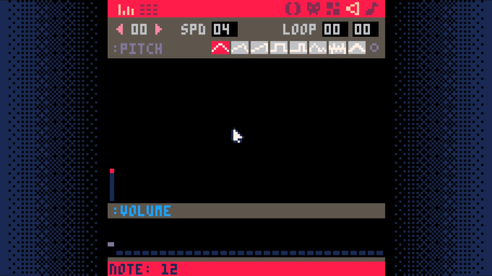

# Movement

<iframe width="560" height="315" src="https://www.youtube.com/embed/T9z6RPvyypE" title="YouTube video player" frameborder="0" allow="accelerometer; autoplay; clipboard-write; encrypted-media; gyroscope; picture-in-picture" allowfullscreen></iframe>

Create a sound effect for bumping into an obstacle.

Do this by going to the sound editor. Change the settings of the sounds to
match those you see in the screenshot. Press `space` to play your sound to test
it out.



Add two functions `is_tile` and `can_move` to the map code tab.

```lua
function is_tile(tile_type,x,y)
 tile=mget(x,y)
 has_flag=fget(tile,tile_type)
 return has_flag
end

function can_move(x,y)
 return not is_tile(wall, x, y)
end
```

Add a function for moving the player to the player code tab.

_Note:_ to get the arrow characters, use **shift+L**, **shift+R**, **shift+U**, **shift+D**.

```lua
function move_player()
 newx=p.x
 newy=p.y

 if (btnp(L)) newx-=1
 if (btnp(R)) newx+=1
 if (btnp(U)) newy-=1
 if (btnp(D)) newy+=1

 if can_move(newx,newy) then
  p.x=mid(0,newx,127)
  p.y=mid(0,newy,63)
 else
  sfx(0)
 end

end
```

Call this function from function update in the game loop tab.

```lua
function _update()
 move_player()
end
```

## End Result

Save your changes with **ctrl+s**. Run them with **ctrl+r**. You should now be able
to move your player around the screen, but once you go off of the screen, you are
no longer able to see them. In the next section, we will make the camera follow
the player so we can explore more of the map.

<iframe width="750px" height="680px" src="./adventuregame_step_03.html"></iframe>
<a href="./adventuregame_step_03.p8.png" target="_blank">Download</a>

