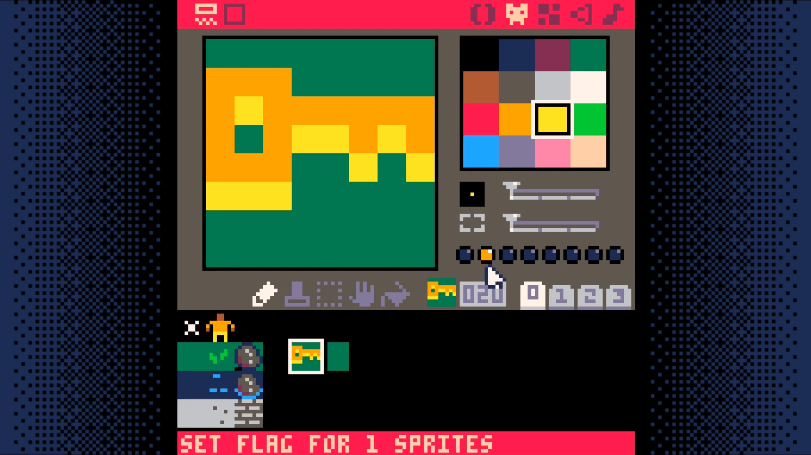
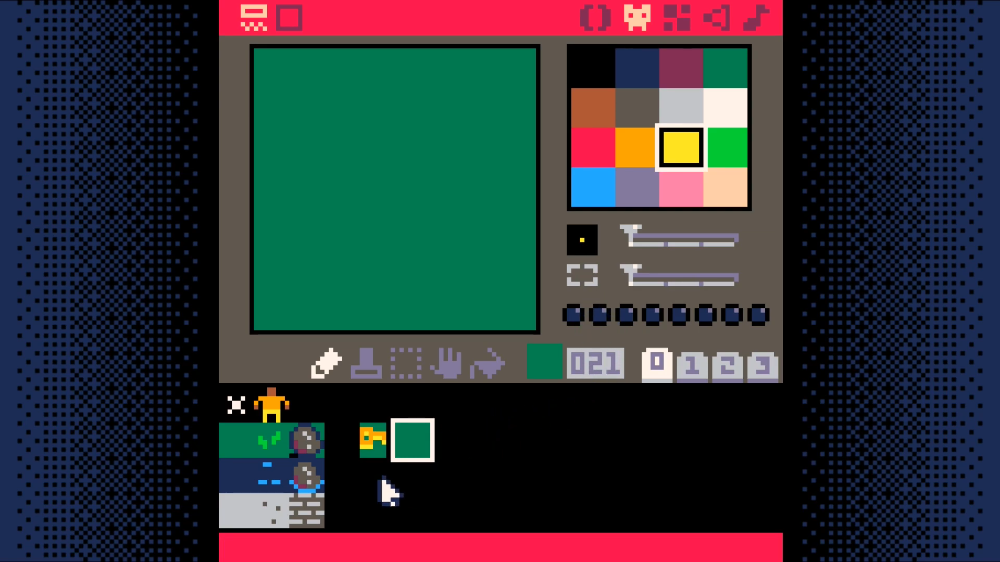
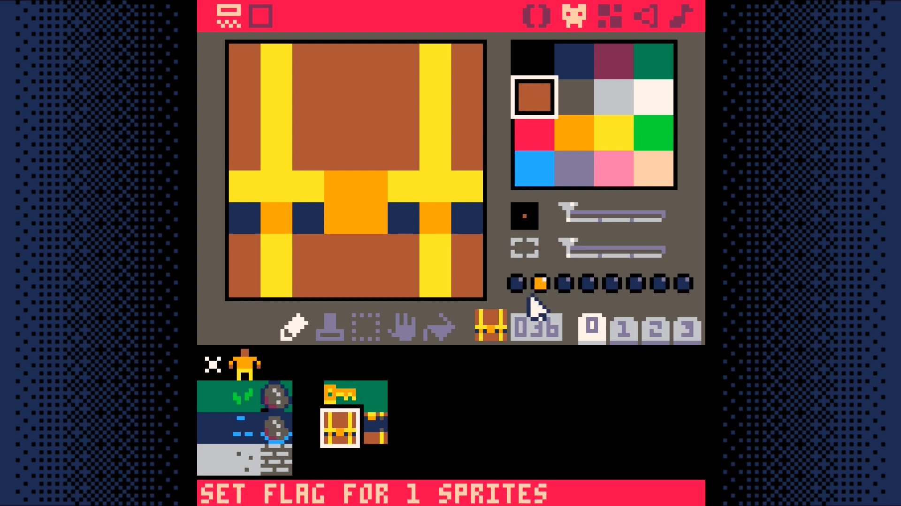
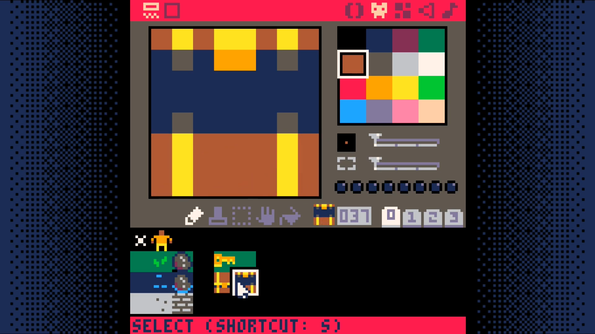
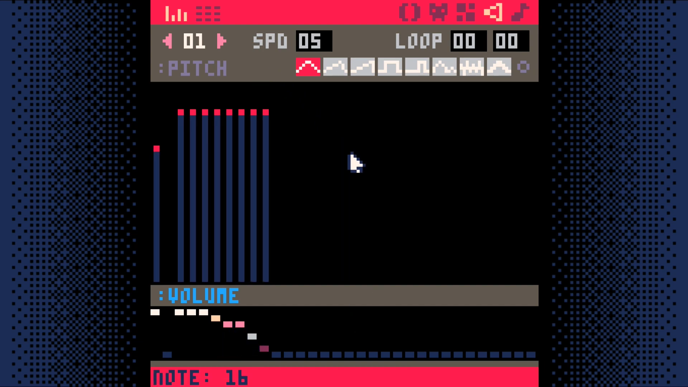

# Keys

<iframe width="560" height="315" src="https://www.youtube.com/embed/8RXnQYXufB8" title="YouTube video player" frameborder="0" allow="accelerometer; autoplay; clipboard-write; encrypted-media; gyroscope; picture-in-picture" allowfullscreen></iframe>

We are going to add items for our player to interact with in our world. One
will be a key they can pick up. The other will be a chest they can open.

You will need to draw two sprites for each of them.

For the key, the first will be what the key looks like when it can be picked
up. The second will be what the tile should look like after the key has been
picked up. In the example, it looks just like the grass tile.

You may ask, why not just reuse the grass tile? Why draw a duplicate? The
reason is that it greatly simplifies the code we have to write to handle
picking up keys.

Whenever the player interacts with a key tile in our world, we will simply
replace the sprite that received the interaction with the sprite immediately to
the right of it in the sprite sheet.

This means that it is **very** important that the tile without the key be
immediately to the right of the tile with the key!

Go ahead a draw the two key sprites now. You will want to set sprite flag 1 on
the key (but not the tile without the key). Sprite flag 1 is what we use to
determine if the player can interact with a tile.





For the chest, we need a sprite showing a closed chest and one showing an open
one. The closed chest needs to have sprite flag 1 set on it.

Just as with the key sprites, it is **very** important that the closed chest
sprite be immediately to the right of the open chest sprite.





Make a sound effect for the pick-up key sound.

Go to the sound editor. Switch from sound `00` to sound `01`. Try replicating
what is shown in the screenshot or feel free to make up your own sound.



Now we need to add the code that allows the player to pick up keys. Interacting
with either the key on the ground or the chest will give the player a key.

Add two functions, `swap_tile` and `get_key`, to the map code tab.

```lua
function swap_tile(x,y)
 tile=mget(x,y)
 mset(x,y,tile+1)
end

function get_key(x,y)
 p.keys+=1
 swap_tile(x,y)
 sfx(1)
end
```

The `swap_tile` function replaces the current tile with the tile immediately to
the right of it in the sprite sheet. This is why we had to draw the key and
chest variants where we did.

The `get_key` function increases the count of the keys the player is carrying
by one, swaps the tile to show that the player successfully interacted with the
tile, and plays a sound to give an audible indication of the action.

Just adding these two functions changes nothing in our code. We have to call
one of them from somewhere.

Add a function called `interact` to the player code tab.

```lua
function interact(x,y)
 if (is_tile(key,x,y)) then
  get_key(x,y)
 end
end
```

This function checks to see if the tile is a key tile. If it is, it calls the
`get_key` function to pick up the key.

Now call this function from the `move_player` function.

```lua
function move_player()
 newx=p.x
 newy=p.y

 if (btnp(L)) newx-=1
 if (btnp(R)) newx+=1
 if (btnp(U)) newy-=1
 if (btnp(D)) newy+=1

 interact(newx,newy)
```

## End Result

Save your changes with **ctrl+S**. Run them with **ctrl+R**. You should now be
able to have your character pick up keys, but you will not be able to see how
many keys your character is holding. We will fix that in the next section.

<iframe width="750px" height="680px" src="./adventuregame_step_05.html"></iframe>
<a href="./adventuregame_step_05.p8.png" target="_blank">Download</a>


{{#include ../source_code.md}}
```lua
{{#include listing.md}}
```
