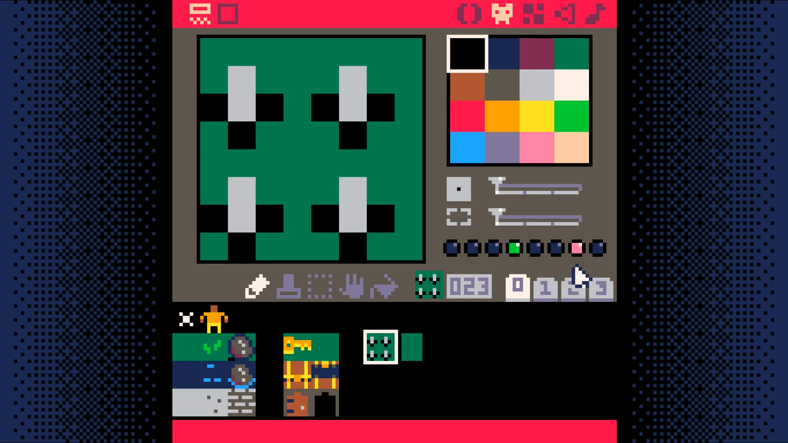
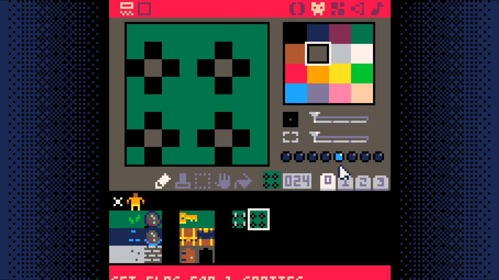

# Animate Tiles

<iframe width="560" height="315" src="https://www.youtube.com/embed/MkXeXYPF2pw" title="YouTube video player" frameborder="0" allow="accelerometer; autoplay; clipboard-write; encrypted-media; gyroscope; picture-in-picture" allowfullscreen></iframe>

In this step we add animated tiles. Animated tiles bring the map to life. Here we'll use them to make a spike trap that the player has to navigate through.

Create a pair of sprites, one for the spikes up and one with the spikes down. The animation will have cause the two sprites to flip between each other.

The tile with spikes up should have two flags set: **flag 3** (anim1, or step one of the animation) and **flag 6** (lose), which will cause the player to lose if they step on them.



The tile with spikes down should have one flag set: **flag 4**, (anim2, step 2 of the animation).



Add two variables to the `map_setup` function in the map code tab.

```lua
function map_setup()
 --timers
 timer=0
 anim_time=30 -- 30 = 1 second
```

Add a new function `unswap_tile` to the map code tab. Note that this function is nearly the same as `swap_tile` and so you can use copy paste to write it.

```lua
function unswap_tile(x,y)
 tile=mget(x,y)
 mset(x,y,tile-1)
end
```

Add a new tab, animation code. Add a new function `toggle_tiles` to this tab.

```lua
function toggle_tiles()
 for x=mapx,mapx+15 do
  for y=mapy,mapy+15 do
   if (is_tile(anim1,x,y)) then
    swap_tile(x,y)
    sfx(3)
   elseif (is_tile(anim2,x,y))then
    unswap_tile(x,y)
    sfx(3)
   end
  end
 end
end
```

Add a new function called `update_map` to the map code tab.

```lua
function update_map()
 if (timer<0) then
  toggle_tiles()
  timer=anim_time
 end
 timer-=1
end
```

Finally, call the `update_map` function from the `_update` function in the `game loop` (**tab 0**).

```lua
function _update()
 update_map()
 move_player()
end
```

## End Result

Save your changes with **ctrl+S**. Run them with **ctrl+R**. Your animated tiles
should change about once every second, but there still isn't a way to win the
game. Lets add that next.

<iframe width="750px" height="680px" src="./adventuregame_step_08.html"></iframe>
<a href="./adventuregame_step_08.p8.png" target="_blank">Download</a>

