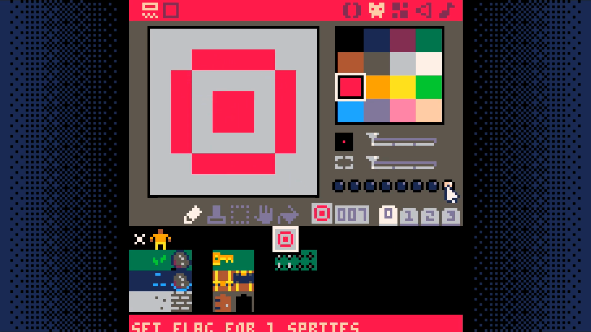

# Winning and Losing

<iframe width="560" height="315" src="https://www.youtube.com/embed/aKnlApA_42U" title="YouTube video player" frameborder="0" allow="accelerometer; autoplay; clipboard-write; encrypted-media; gyroscope; picture-in-picture" allowfullscreen></iframe>

Add a new sprite that the player has to move over to win the game.



Set the last flag on this sprite. This is what the game will use to know the player
has won the game.

Add `game_win` and `game_over` to `_init` in the `game loop` **tab 0**.

```lua
function _init()
 map_setup()
 make_player()

 game_win=false
 game_over=false
end
```

Add a new code tab to hold the win/lose code. This will be **tab 5**.

In this tab, add two new functions: `check_win_lose`, `draw_win_lose`

```lua
-- win/lose code

function check_win_lose()
 if (is_tile(win,p.x,p.y)) then
  game_win=true
  game_over=true
 elseif (is_tile(lose,p.x,p.y)) then
  game_win=false
  game_over=true
 end
end

function draw_win_lose()
 camera()
 if (game_win) then
  print("S you win! S",37,64,7)
 else
  print("game over!",38,64,7)
 end
end
```

Change `_update` to only run if not `game_over` and call `check_win_lose`

```lua
function _update()
 update_map()
 move_player()
 if (not game_over) then
  update_map()
  move_player()
  check_win_lose()
 end
end
```

Change `_draw` to only draw if not `game_over` else `draw_win_lose`

```lua
function _draw()
 cls()
 draw_map()
 draw_player()
 if (btn(X)) show_inventory()
 if (not game_over) then
  draw_map()
  draw_player()
  if (btn(X)) show_inventory()
 else
  draw_win_lose()
 end
end
```

## End Result

Save your changes with **ctrl+S**. Run them with **ctrl+R**. You should now be able
to walk into spikes to lose and walk into the target to win. Next, we will add a way
to easily reset the game.

<iframe width="750px" height="680px" src="./adventuregame_step_09.html"></iframe>
