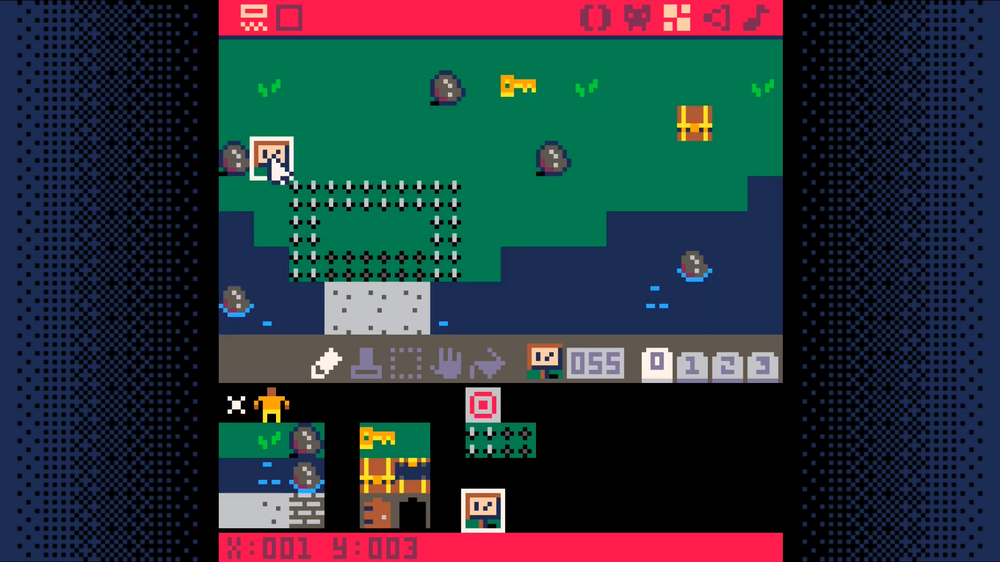
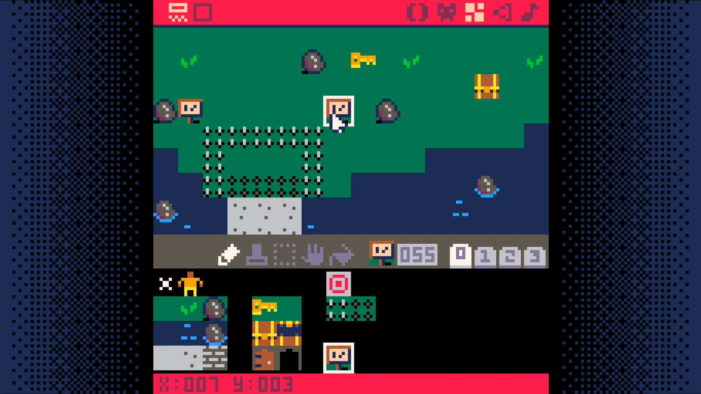
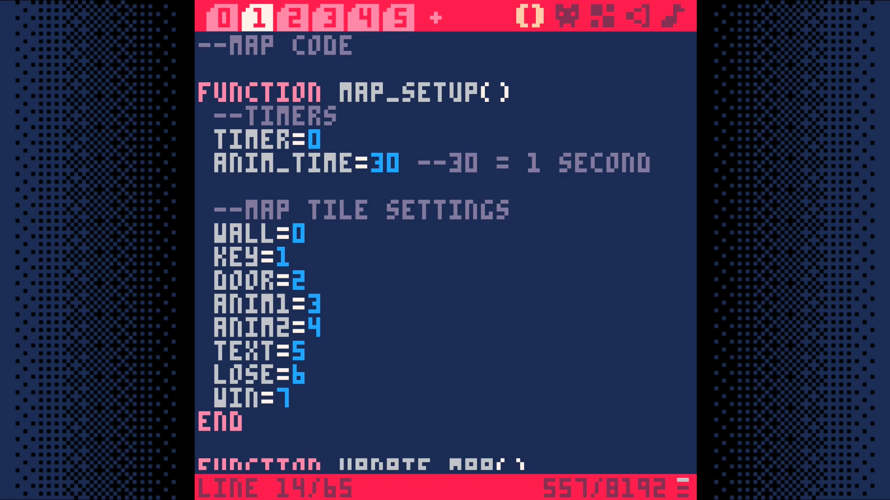
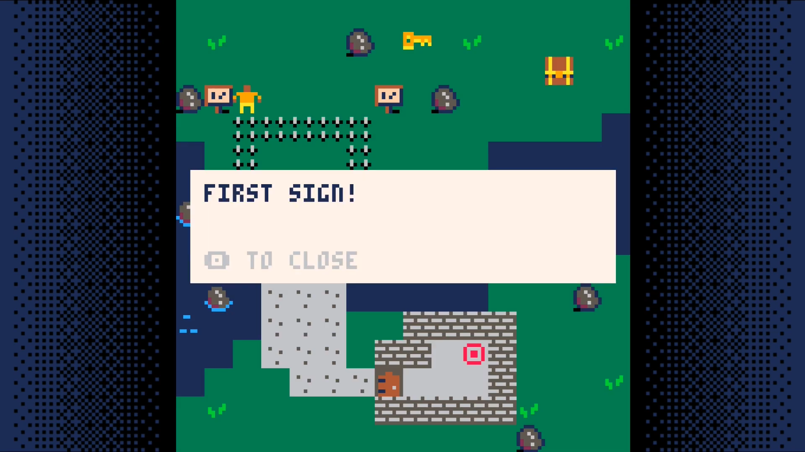
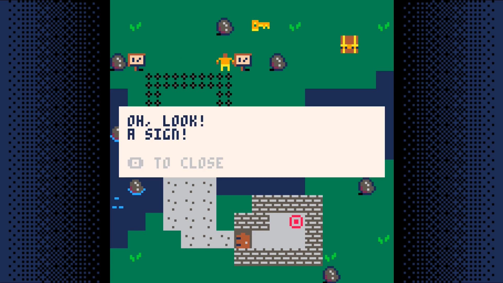

# Bonus Step: Adding Text
This step will be a bit more involved than the previous steps. If you have
made it to this step, you will definitely be able to complete it. Just take
it slow and don't rush.

Create a sign sprite.


Place two of them. If you don't place them at x=1,y=3 and x=7,y=3 you will need to update the code to reflect where the signs are placed in your world.





Add `text=5` to the `tile settings` in `map_setup`.  We are going to use this
to trigger the display of text to the user.



Now, let's add some code to make use of this tile type.

In tab `0`, add a call to `text_setup`
```lua
function _init()
 map_setup()
 text_setup()
 make_player()
 
```

Modify the `_update` call to only update the game state if there is no active text displayed.
```lua
function _update()
 if (not game_over) then
  if (not active_text) then
   update_map()
   move_player()
   check_win_lose()
  end
```

In `_draw`, call `draw_text` after drawing the map and the player.
```lua
function _draw()
 cls()
 if (not game_over) then
  draw_map()
  draw_player()
  draw_text()
```

In the player interaction code, tab `2`, add a check for the text tile type.
```lua
function interact(x,y)
 if (is_tile(text,x,y)) then
  active_text=get_text(x,y)
 end

```

Add a new tab. This will be tab `6`. We will put the text related code here.
```lua
--text code

function text_setup()
 texts={}
 add_text(1,3,"first sign!")
 add_text(7,3,"oh, look!\na sign!")
end

function add_text(x,y,message)
 texts[x+y*128]=message
end

function get_text(x,y)
 return texts[x+y*128]
end

function draw_text()
 if (active_text) then
  textx=mapx*8+4
  texty=mapy*8+48
  
  rectfill(textx,texty,textx+119,texty+31,7)
  print(active_text,textx+4,texty+4,1)
  print("_ to close",textx+4,texty+23,6)
 end
 
 if (btnp(_)) active_text=nil
end
```

Save your game and run it. With any luck, you should be able to walk up to and read each sign.





This opens up a world of possibilities. It allows to add Non-Player Characters
(NPCs) that can speak with your character. Signs can provide instructions or
warnings. You are able to tell your character's back story through dialog or notes or other narrative devices.

# Result
<iframe width="750px" height="680px" src="./adventuregame_bonus_step_text.html"></iframe>
<a href="./adventuregame_bonus_step_text.p8.png" target="_blank">Download</a>

{{#include ../source_code.md}}
```lua
{{#include listing.md}}
```
