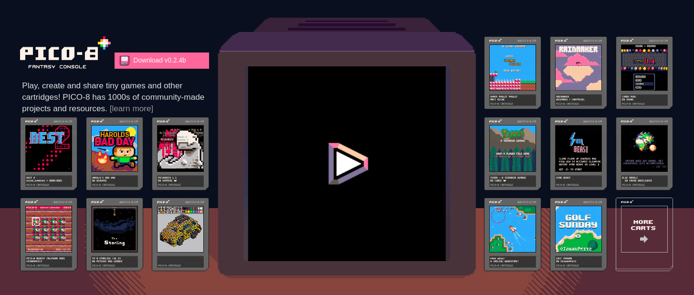

# Homepage

The [PICO-8 Homepage](https://www.lexaloffle.com/pico-8.php) is the initial
entrypoint into the wonderful world of this quirky, magical fantasy console.

At the top of the page is a selection of carts you can play right in your
browser. Just click on the play button to get started!

Games run in the browser cannot (currently) be edited. You need the full PICO-8
client to do that, but it won't stop you from exploring the many amazing
creations by the PICO-8 community. You don't even need a license to do so!

Immediately below that is the navigation bar. It provides links to Lexaloffle's
other products and quick links to various other sections of the site.

Be sure to check out the FAQ and Resources sections if you have any questions not answered by the main page!

Below that is a summary of the console and its features.

Scroll to the bottom of the page to purchase. This unlocks the full world of
PICO-8 on Windows, macOS, and Linux!

