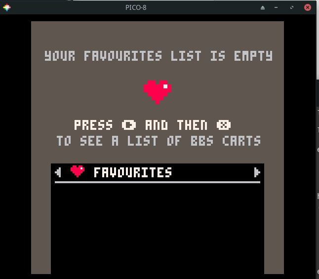
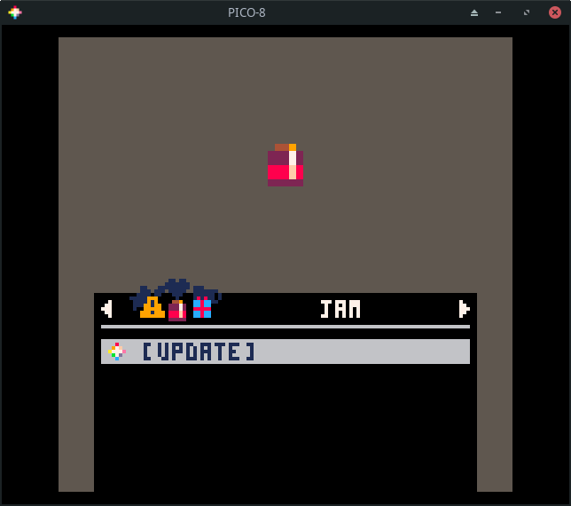
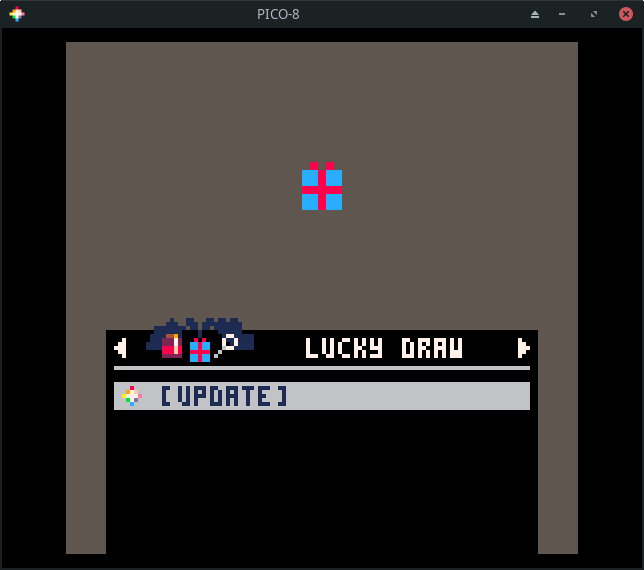
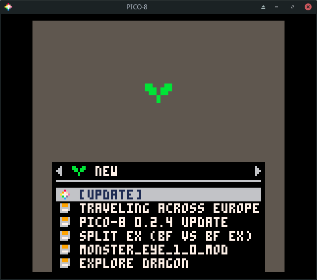
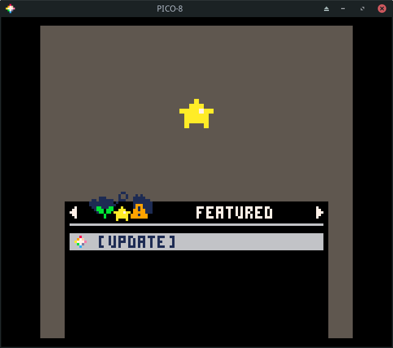
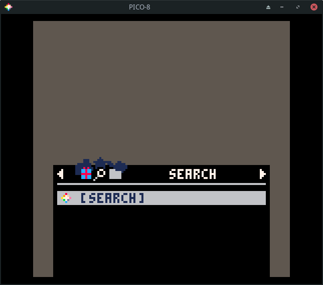
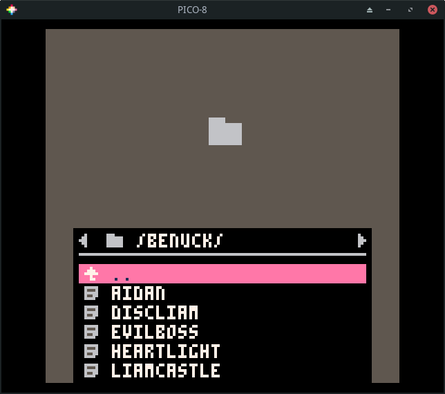
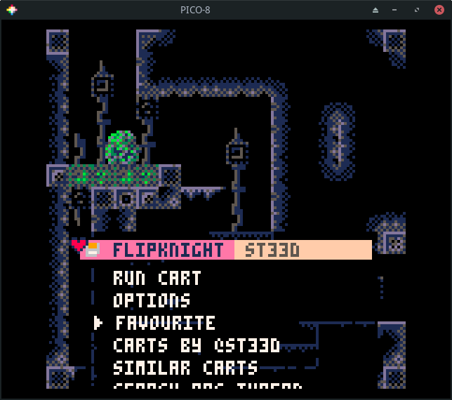
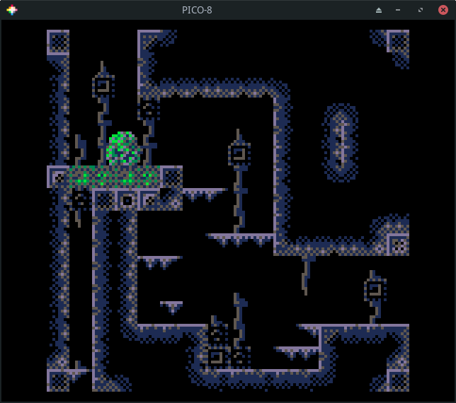
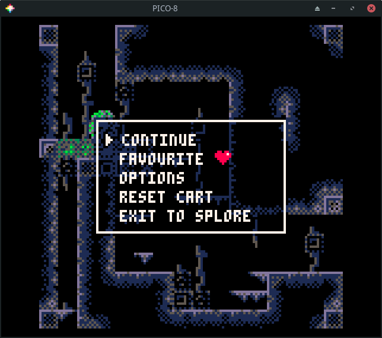

# Splore

The command `splore` is used to launch an in-process game browser. The `splore`
tool provides several updatable game lists.

This first of these is the `favorites` view. It will be empty to start.
Whenever you select a cart, you have the option to tag it as a favorite so it
shows up here.

Pressing the `R` arrow takes you to the *Game Jam* section. These are carts
created during *Game Jams* which are time limited competitions where
participants write a game using a common theme as inspiration.

Press `R` to see a list of randomly chosen games. If you are tired of going
through the featured list, this is sometimes a good way to find something new.

Press `R` again to go to a list of `new` games. These are the most recent
community uploads. The quality of the games in this list is going to be hit or
miss. Not all of them will be complete.

Press `R` again to see my favorite list, the `featured` list. These are
usually very high quality games or demos that highlight what is possible using
PICO-8. My kids greatly enjoy going through this list and playing the games
that catch their eye.

The next section is one that lets you search for games. This is helpful if you
have a particular game you are trying to find or want to see what the community
has made on a specific topic.

The final section lets you browse your local files. These are the same files
you will see by running `ls` from the command prompt.

# Browsing Games

Let's go back to the `featured` list. Press `enter` to update the list. This
requires Internet access! It will data about a number of games.

If you don't have Internet access, run the `install_demos` command to install
and run a few demo carts.

Use the arrow keys to navigate the list.

If you press `enter` on a game, you will have the option to `run` or `favorite`
the game.

Choosing `run` will start the game. Most games give show a title screen and
main menu. Some, like `flip knight` do not. Nearly all games can be controlled
using a combination of the arrow keys and the action keys (z and x). z maps to
`X` and x maps to `O`. When in doubt, just start pressing the action keys to
see what happens!

Press `esc` and choose `exit to splore` if you want to exit the game.

