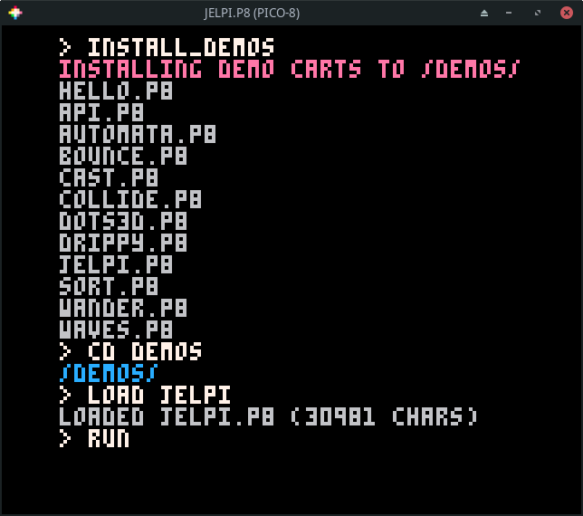
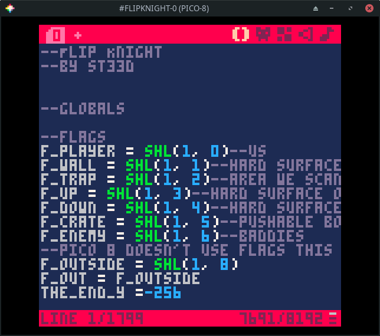
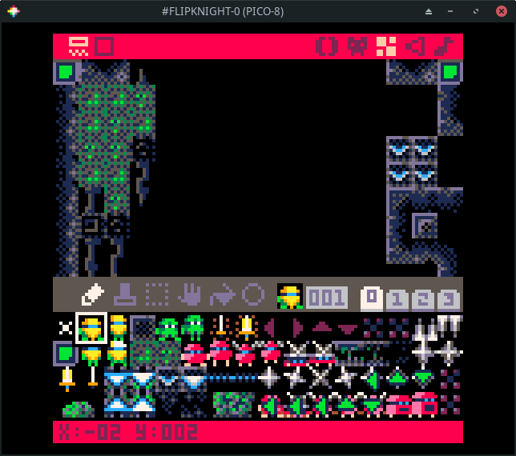
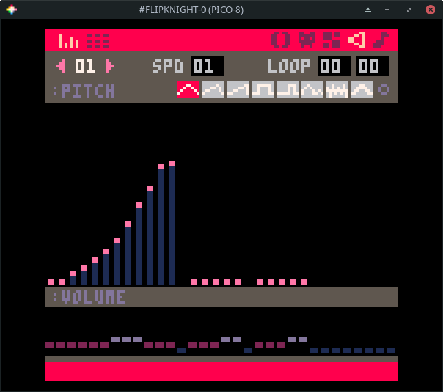
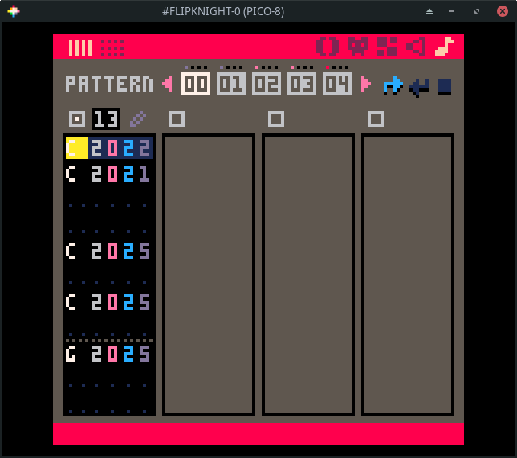

# Overview

PICO-8 is like an emulator for a video game console that was never made. But,
unlike a typical emulator, PICO-8 includes the ability to browse and download
games. What's more, is that the PICO-8 environment includes all the tools you
need to create and modify games, whether they are ones of your own creation or
ones that you downloaded yourself.

# Environment

When you first launch PICO-8, you are presented with a command prompt. This is
a bit like the prompt computers that ran MS-DOS would boot to back in the 1980's.

## Commands

These are some of the commands you can run. Don't run any of these just yet.

* LS - show the files in the current directory
* RUN (or ctrl-r) - run the current cartridge
* SAVE (or ctrl-S) - save the current cartridge
* INSTALL\_DEMOS - install a few demo cartridges
* SHUTDWON (or ctrl-q) - quit PICO-8
* REBOOT - restart PICO-8
* SPLORE - explore community created cartridges

# Splore

Let's run the `splore` command now.

You will be greeted with the `favorites` view. It will be empty to start.
Whenever you select a cart, you will be able to tag it as a favorite so it
shows up here.


Pressing the `right` arrow takes you to the *Game Jam* section. These are carts
created during *Game Jams* which are time limited competitions where
participants write a game using a common theme as inspiration.


Press 'right' to see a list of randomly chosen games. If you are tired of going
through the featured list, this is sometimes a good way to find something new.


Press 'right' again to go to a list of `new` games. These are the most recent
community uploads. The quality of the games in this list is going to be hit or
miss. Not all of them will be complete.


Press 'right' again to see my favorite list, the `featured` list. These are
usually very high quality games or demos that highlight what is possible using
PICO-8. My kids greatly enjoy going through this list and playing the games
that catch their eye.

We will return to this list shortly.


The next section is one that lets you search for games. This is helpful if you
have a particular game you are trying to find or want to see what the community
has made on a specific topic.


The final section lets you browse your local files. These are the same files
you will see by running `ls` from the command prompt.


# Browsing Games

Let's go back to the `featured` list. Press `enter` to update the list. This
requires Internet access! It will data about a number of games.


If you don't have Internet access, run the `install_demos` command to install
and run a few demo carts.



Use the arrow keys to navigate the list.


If you press `enter` on a game, you will have the option to `run` or `favorite`
the game.


Choosing `run` will start the game. Most games give show a title screen and
main menu. Some, like `flip knight` do not. Nearly all games can be controlled
using a combination of the arrow keys and the action keys (z and x). z maps to
`X` and x maps to `O`. When in doubt, just start pressing the action keys to
see what happens!


Press `esc` and choose `exit to splore` if you want to exit the game.


# Editing a Downloaded Game

As mentioned earlier, any game you run in PICO-8 can also be edited in PICO-8!
This gives you super powers. It allows you to customize any aspect of a game
you want! Let's take a peek in a cart to learn about the built-in editing
tools.

Run a game that looks interesting (or the Jelpi demo, if you don't have
Internet access). Once it is running, hit `esc`. If it gives you the option to
`exit to splore`, choose it and hit `esc`. Otherwise, just hit `esc`. This
should put you at a prompt. (It is the `> ` at the top of this next
screenshot.)


Now, hit `esc` to go into the code editor. This shows you all of the code in
the game you were running most recently.

The currently active tool is highlighted in the top right corner of the screen
(`()` in the example.)

If the game makes use of mulitple code tabs, these will appear in the top left.
The game in the screenshot only has a single code tab (labeled `0`).



To see the sprites (which include character and background graphics), click on
the face icon in the top right. It is just to the right of the `()` icon.

Unless you are editing the same game as me, the contents of this page will look
different.

PICO-8 uses a fixed pallete (those are the colors used in the sprites). This
pallete is shown in the top right. In the example, a light gray color is
selected. The current sprite is shown in the top left. Sprites are 8 pixels
wide and 8 pixels tall.

The available sprites are shown in the bottom pane. In this example, sprite
`001` is selected.

There are a number of tools just above the bottom pane. These include a pencil,
selection, movement, and paint bucket tool (among others).

Zoom levels, sprite pages, and sprite flags are also on this page, but those
will be discussed when and where they are used in the tutorials.


Sprites don't do us much good if they are not placed in a world. Most PICO-8
carts make use of the built-in map memory to display their sprites. The map
editor is to the right of the sprite editor. Click on it!



To the right of the map editor is the sound editor. Click on it!



To the right of the sound editor is the music editor. Click on it!



Those are all of the built-in tools. The [PICO-8
Manual](https://www.lexaloffle.com/dl/docs/pico-8_manual.html) provides more
details about how to navigate and use the built-in tools. There's also a text
version included in your pico-8 installation! Look for `pico-8.txt`.

Making modifications to existing games is a great way to become familiar with
the tools and to express your own creativity. This is best done with simpler
titles as titles that push the limits of the console end up using advanced
techniques to cram everything into the limits of the console which makes
modifications more difficult than normal.

If you do end up wanting to make changes, hit `esc` to go to the prompt and
then use `save` to save the cart under a different name. Then feel free to make
the changes you want. Try them out by pressing `ctrl-r` or using the `run`
command. If you decide you don't like your changes, `load` your previously
saved version. If you like them, save them with `ctrl-s` or the `save command.

# Creating Your Own Games

Now that we have explored an exist cart. Let's try making a simple cart.

Get to the prompt and run `reboot`. This will reset PICO-8.

Hit `esc` to go the code editor and enter the following.

* shift-L = `L`
* shift-R = `R`
* shift-U = `U`
* shift-D = `D`

```lua
function _init()
 col=7
 x=10
 y=10
end

function _update()
 if btn(L) then x-=1 end
 if btn(R) then x+=1 end
 if btn(U) then y-=1 end
 if btn(D) then y+=1 end
end

function _draw()
 cls()
 for i=1,5 do
  circfill(x,y,10-i*2,col+i)
 end
end
```

Hit `ctrl-r` to run it (or use the `run` command). You should see a
multi-colored circle that you can move around with the arrow keys.


Run `save move_circle` if you want to save it.
