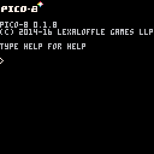

# DRAFT: A Spaceshooter in 16 Steps

[This is a fun take](https://ztiromoritz.github.io/pico-8-shooter/) on a tutorial format. It shows how to make a spaceshooter, but instead of creating videos or a written tutorial, it uses a series of 16 animated images.

Local versions of the origianl images are inlined below. Each of the nested sections is devoted to a single image. Since animated gifs cannot be paused, the images have been converted to videos so you can control the playback speed or pause, as needed.

Over time, a written version of each step will be created, but if you want to dive in now, feel free to work off of the embedded videos.

