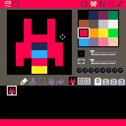

# 01. Draw ship on screen

<video controls width="512" poster="./tut_1.gif">
    <source src="./tut_1.mp4"
            type="video/mp4">
    Sorry, your browser doesn't support embedded videos.
</video>

[Image](./tut_1.git) ([Original Source](https://ztiromoritz.github.io/pico-8-shooter/gif/tut_1.gif))

Let's start by creating a ship sprite in the sprite editor.

<div></div>

Go to the code editor and enter this code in tab **0**.

Now let's draw the ship on the screen!

```lua
function _init()
 ship={x=60,y=60}
end

function _draw()
 cls()
 spr(1,ship.x,ship.y)
end
```

The `_init` function creates a table to hold properies for the ship. We will
start with its `x` and `y` coordinates. This is how we will know where to draw
the ship on the screen.

The `_draw` function displays sprite `1` on the screen at the `x` and `y`
coordinates in the `ship` table. **Note:** if your ship is not in the sprite
sheet at location `001` (as shown in the screenshot above), you will need to
change the first parameter to `spr` to match.

## End Result
<iframe width="750px" height="680px" src="./ss_01.html"></iframe>
<a href="./ss_01.p8.png" target="_blank">Download</a>

{{#include ../source_code.md}}
```lua
{{#include listing.md}}
```
