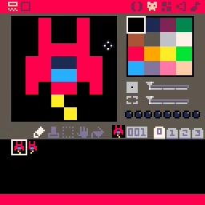
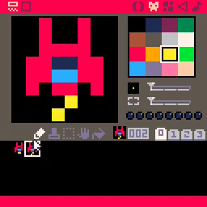
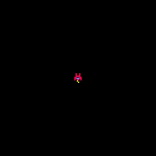

# 02. Animate Propulsion

<video controls width="512" poster="./tut_2.gif">
    <source src="./tut_2.mp4"
            type="video/mp4">
    Sorry, your browser doesn't support embedded videos.
</video>

[Image](./tut_2.git) ([Original Source](https://ztiromoritz.github.io/pico-8-shooter/gif/tut_2.gif))

In this step, we will create a ship propulsion animation.

Start by modifying the ship we drew in the last step.

**Tip:** Press up to shift the ship up a pixel. This will give you the space
you need to add the jetstream pixel without having to redraw the ship!

<!--
Not sure why these img tags need to be wrapped in divs.
They don't render otherwise...
-->
<div></div>

Now create a second ship where the jetstream pixels swap.

<div></div>

Enter this code on tab **0** in the code editor.

```lua
t=0
function _init()
 cls()
 ship={sp=1,x=60,y=60}
end

function _update()
 t=t+1
 if(t%6<3) then
  ship.sp=1
 else
  ship.sp=2
 end
end

function _draw()
 cls()
 spr(ship.sp,ship.x,ship.y)
end
```

Hit `ctrl-r` to run the game. A ship will appear with an animated jetstream!

<div></div>

