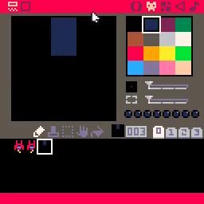
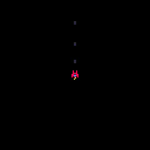

# 04. Fire Laser Bullets

<video controls width="512" poster="tut_4.gif">
    <source src="./tut_4.mp4"
            type="video/mp4">
    Sorry, your browser doesn't support embedded videos.
</video>

[Image](./tut_4.git) ([Original Source](https://ztiromoritz.github.io/pico-8-shooter/gif/tut_4.gif))

Update `_init` to have a table to hold information about all of the bullets.

```lua
function _init()
 ship={sp=1,x=60,y=60}
 bullets={}
end
```

Now add a `fire` function right after `_init`. It creates a new bullet and add
it to the bullets table.

```lua
function fire()
 local b={
  sp=3,         -- which sprite to display for bullets
  x=ship.x,     -- start bullets at the ship's location
  y=ship.y,
  dx=0,
  dy=-3,        -- bullets move up from the ships location
 }
 add(bullets,b) -- add bullet to the table of bullets
end
```

`sp` is the sprite to display. `x` and `y` indicate where to display the ship on the screen. `dy` is how far to move the bullets up the screen on each frame.

Bullets move after being fired. Add the code to do that in `_update`.

```lua
function _update()
 t=t+1

 for b in all(bullets) do
  b.x+=b.dx
  b.y+=b.dy
 end
```

We will need a way to trigger the firing of a bullet. Add this `if` statement at the end of `_update`. It will cause a bullet to fire if you press `X`.

```lua
if btnp(X) then fire() end
```

**Note:** We use `btnp` instea of `btn` to limit the rate of firing. 

Let's display the bullets.

```lua
function _draw()
 cls()
 spr(ship.sp,ship.x,ship.y)
 for b in all(bullets) do
  spr(b.sp,b.x,b.y)
 end
end
```

Finally, let's actually create the bullet sprite so we have something to draw!

<div></div>

Hit `ctrl-r` to run the game and then press `X` a few times. You should see something like this.

<div></div>

Don't get carried away and fire too many! The code we wrote in this step has a
**fatal** flaw. It never forgets about any of the bullets that have been fired. As
bullets are fired an ever increasing amount of memory is consumed. It will also
take an ever increasing amount of time to update the position of the bullets
and draw them.  Taken to the extreme, it has the potential to crash the game or
make it unplayable.

This isn't a safe play to remain so we will address this in the next step.

