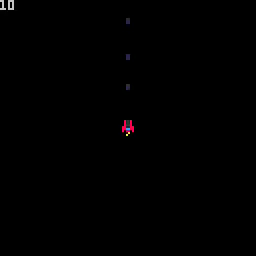
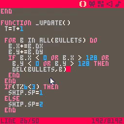
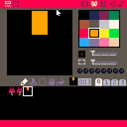
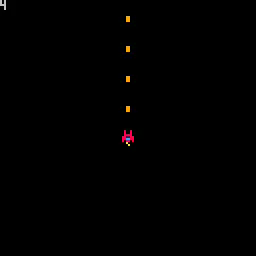

# 05. Remove Bullets

<video controls width="512" poster="tut_5.gif">
    <source src="./tut_5.mp4"
            type="video/mp4">
    Sorry, your browser doesn't support embedded videos.
</video>

[Image](./tut_5.git) ([Original Source](https://ztiromoritz.github.io/pico-8-shooter/gif/tut_5.gif))

The last step ended with a warning about a defect in our game. Defects happen
all the time when we code so it is good idea to learn how to find, reproduce,
and fix them.

Let's imagine that a player of our game reported a bug complaining that the
game was exhibiting unbounded resource consumption. The best bug reports come
with steps to reproduce, but we are not always so lucky.

Without steps to reproduce, the first step is to develop a theory for what
could be leading to the behavior described in the report. In this case, our
game is really simple. We display a single ship, can move it around, and can
repeatedly press a button to fire bullets.

Our game displays itself at 30 frames per second. It is theoretically possible
that something in the display logic has a memory leak, but such a defect would
most likely be showing up in other games. As a general rule of thumb, don't
blame your tools! Most of the time the problem is in the code you have just
written and not in a tool that has gone through a rigorous testing process.

Looking back at the code we've written, the only place where we accumulate
additional state instead of just overwriting it is the code to add new bullets
so that seems like the best place to focus.

Now that we have a theory (that the bullet handling code is causing the
resource consumption), it would be nice to be able to prove it.

Let's add some code to illustrate the problem. We will display the number of
bullets we are tracking. If the bullets are not being cleaned up, the count
should only ever go up.

```lua
function _draw()
 cls()
 print(#bullets,9)
```

Hit `ctrl-r` to run the game and fire some bullets.

<div></div>

In the screenshot above, we have fired a total of `10` bullets, but only `3`
are visible on the screen. This clearly indicates the problem. We should only
be tracking bullets that are visible. Anything that has gone off the screen is
a waste of memory and processing time.

<div></div>

That gives us an outline of what the fix should be. Let's implement it.

```lua
function _update()
 t=t+1

 for b in all(bullets) do
  b.x+=b.dx
  b.y+=b.dy
  if b.x<0 or b.x>128 or
   b.y<0 or b.y>128 then
   del(bullets,b)
  end
 end
```

If a bullet's `x` or `y` coordinates ever go outside of the screen bounds, we
can safely get rid of it. The screen bounds are 0-128.

Before we test it, let's make a change to our bullet sprite to the bullets
stand out a bit more.

<div></div>

Run the game with `ctrl-r` and let's see if we can get the number of bullets
being tracked to exceed the number of bullets on the screen.

<div></div>

The numbers now match no matter how many bullets we fire. Success! Bug fixed
and crisis averted!
