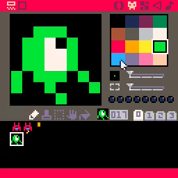
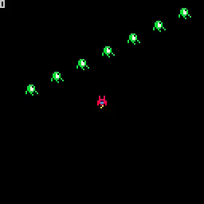

# 06. Draw Enemies

<video controls width="512" poster="tut_6.gif">
    <source src="./tut_6.mp4"
            type="video/mp4">
    Sorry, your browser doesn't support embedded videos.
</video>

[Image](./tut_6.git) ([Original Source](https://ztiromoritz.github.io/pico-8-shooter/gif/tut_6.gif))

Start by adding a table to track enemies. Populate it with `10` enemies.

```lua
function _init()
 ship={sp=1,x=60,y=60}
 bullets={}
 enemies={}
 for i=i,10 do
  add(enemies, {
   sp=17,
   x=i*16,
   y=60-i*8
  })
 end
end
```

At the end of the `_draw` function, add code to display the enemies.

```lua
for e in all(enemies) do
 spr(e.sp,e.x,e.y)
end
```

Finally, let's add an enemy at location `017`.

<div></div>

Press `ctrl-r` to run the game and you should see some enemies! You won't be
able to destroy them and they don't move, but it is a start!

<div></div>

