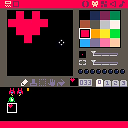
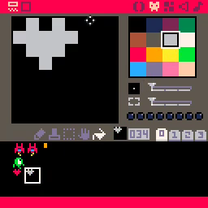
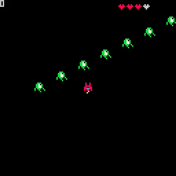

# 08. Points and Health

<video controls width="512">
    <source src="./tut_8.mp4"
            type="video/mp4">
    Sorry, your browser doesn't support embedded videos.
</video>

[Image](./tut_8.git) ([Original Source](https://ztiromoritz.github.io/pico-8-shooter/gif/tut_8.gif))

Let's add a way to keep track of how much health the player has left. We will
use the seemingly ubiquitous measure of **hearts**.

Create two new sprites. The first represents a heart the player has and the
second represents the loss of a heart. These should be placed at locations
`033` and `034`, respectively.

<div></div>
<div></div>

The player will have a total of `4` possible hearts. Let's give them `3` so we can test the display of the missing heart.

```lua
function _init()
 cls()
 ship={sp=1,x=60,y=60,h=3}
```

At the end of `_draw`, add the hearts display logic.

```lua
for i=1,4 do
 if i<=ship.h then
  spr(33,80+6*i,3)
 else
  spr(34,80+6*i,3)
 end
end
```

Press `ctrl-r` to run the game. You should see `3` red hearts and `1` gray
heart in the upper right corner. The hearts should display **on top of** any
enemies that pass by. If not, double check you added the hearts display logic
at the **end** of `_draw` and not any earlier.

<div></div>

Having a way to measure player health is good. Now we need a way to reduce it!
It would also be good to be able to damage those enemies with our trusty laser
cannon.

Implementing either of these first requires that we take a detour into the land
of **collision detection**. This is a vital topic for just about all games.

It will take us a few steps to get through it, but it will be worth it as it
unlocks much of what follows it.

