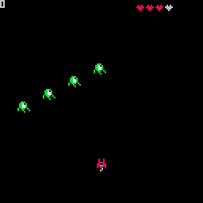
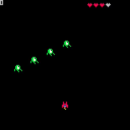

# 09. Collision 1: Cleanup and Prep

<video controls width="512" poster="tut_9.gif">
    <source src="./tut_9.mp4"
            type="video/mp4">
    Sorry, your browser doesn't support embedded videos.
</video>

[Image](./tut_9.git) ([Original Source](https://ztiromoritz.github.io/pico-8-shooter/gif/tut_9.gif))

We are going to make a few minor changes. The first is just a cleanup task.

```lua
function _init()
 t=0

 ship={
  sp=1,
  x=60,
  y=100,
  h=3,
  p=0
 }
```

The variable `t` is now initialized within `_init`. This is just good practice.
It keeps all of your variable initialization in a single location.

The ship is now placed `40` pixels farther down on the screen. This is a more
traditional starting location for a ship in a space shooter.

The ship now holds a `p` property, which will be used to track how many points
the player has scored.

The addition of `p` makes the `ship` initialization a bit too long so we
changed the formatting so it is split over multiple lines. This makes it eaiser
to scan the code.

The final change is a reduction of the number of enemies created from `10` to
`4`. Having fewer entities in the game makes troublshooting collision detection
algorithms a git easier.

Of the changes we made, only the change to the number of enemies should be visible. Verify that by using `ctrl-r` to run the game.

<div></div>

With our bullet defect fixed, we no longer need to display the number of
bullets in our world. Let's reuse it to display the number of points that have
been scored.

```lua
function _draw()
 cls()
 print(ship.p,9)
```

Let's prep for the addition of collision detection. Put this function above the `fire` function.

```lua
function coll(a,b)
 --todo
end

```

In `_update`, call the collision function for each enemy.

```lua
function _update()
 t=t+1

 for e in all(enemies) do
  e.x=e.r*sin(t/50)+e.m_x
  e.y=e.r*cos(t/50)+e.m_y
  if coll(ship,e) then
   --todo
  end
 end
```

Hit `ctrl-r` to run the game. The only visible difference should be that firing a bullet no longer increases the count in the upper left corner.

<div></div>

