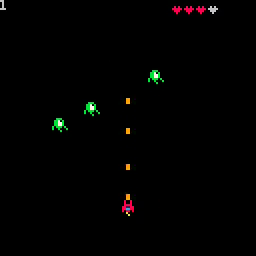

# 11. Collision 3: Collide Boxes

<video controls width="512" poster="./tut_11.gif">
    <source src="./tut_11.mp4"
            type="video/mp4">
    Sorry, your browser doesn't support embedded videos.
</video>

[Image](./tut_11.git) ([Original Source](https://ztiromoritz.github.io/pico-8-shooter/gif/tut_11.gif))

Let's finish the implementation of `coll`.

```lua
function coll(a,b)
 local box_a=abs_box(a)
 local box_b=abs_box(b)

 if box_a.x1>box_b.x2 or
    box_a.y1>box_b.y2 or
    box_b.x1>box_a.x2 or
    box_b.y1>box_a.y2 then
    return false
 end
 
 return true
end
```

This is the only code change shown in the original step 11. The video shows
bullets destroying enemies and the score incrementing by one with each enemy
destroyed, but if you try running the game now, that won't happen.

Luckily, the missing code is modified in step 13 so we can recreate the
original behavior. Add this to `_update`.

```lua
for b in all(bullets) do
 b.x+=b.dx
 b.y+=b.dy
 if b.x<0 or b.x>128 or
  b.y<0 or b.y>128 then
  del(bullets,b)
 end
 for e in all(enemies) do
  if coll(b,e) then
   del(enemies,e)
   ship.p+=1
  end
 end
end
```

Hit `ctrl-r` to run the game. Fire a few bullets with `X`. When one of them
hits an enemey, the enemy should disappear. The score should increment by one
with each enemy you destroy.

<div></div>

