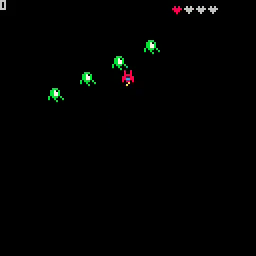
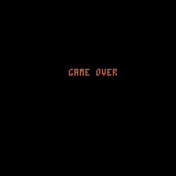

# 13. Health, Game Over, Immortaility

<video controls width="512" poster="./tut_13.gif">
    <source src="./tut_13.mp4"
            type="video/mp4">
    Sorry, your browser doesn't support embedded videos.
</video>

[Image](./tut_13.git) ([Original Source](https://ztiromoritz.github.io/pico-8-shooter/gif/tut_13.gif))

Let's make it possible to lose the game!

Start by adding two properties to the `ship`. `t` will be used in some animation calculations. `imm` is used to indicate if the ship is temporarily invulnerable.

```lua
ship={
 sp=1,
 x=60,
 y=100,
 h=4,
 p=0,
 t=0,
 imm=false,
 box={x1=0,y1=0,x2=7,y2=7}
}
```

The `h=4` in the above snippet isn't a typo. Having the starting number of ship
hearts set to `3` was great for testing the missing heart display
functionality, but we've done that so we no longer need to penalize the player,
especially since we are about to enable them to get hurt!

A couple of steps back, we added a placeholder to check if the ship collided with any enemies. It is time to implement that logic. Add this to `update_game`.

```lua
function update_game()
 t=t+1
 if ship.imm then
  ship.t+=1
  if ship.t>30 then
    ship.imm=false
    ship.t=0
  end
 end

 for e in all(enemies) do
  e.x=e.r*sin(t/50)+e.m_x
  e.y=e.r*cos(t/50)+e.m_y
  if coll(ship,e) and not ship.imm then
   ship.imm=true
   ship.h-=1
   if ship.h<=0 then
    game_over()
   end
  end
 end
```

First, we check the `imm` flag. If it is set, the ship needs to be invulnerable
for a full second (`30` frames). Once that time has passed, clear the flag and
reset the `ship.t` counter.

As we loop through the enemies, check if the ship collided with the current
enemy. If so, set the `imm` flag to give the ship temporary invulnerability.
Reduce the number of hearts by one. Check to see if we are out of hearts. If we
are out of heats, transition to the `game over` state to let the player known.

In `draw_game`, only draw the ship if it is not invulnerable or for ever other four frames, if it is.

```lua
function draw_game()
 cls()
 print(ship.p,6)
 if not ship.imm or t%8<4 then
  spr(ship.sp,ship.x,ship.y)
 end
```

Hit `ctrl-r` to run the game. Move the ship so it is in the path of the
enemies. The number of hearts should reduce by one each time it is hit. After
each hit, the ship should flash off and on periodically over a second before
becoming vulnerable again.

<div></div>

Once the last heart is lost, the game over screen should be displayed.

<div></div>

At this point, we have something that is starting to feel like a real game. The
ship can fire bullets which destroy enemies, it can be damaged by the enemies,
and once all its hearts are lost, the game ends!

