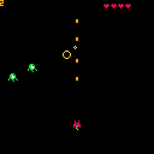

# 14. Explosions

<video controls width="512" poster="./tut_14.gif">
    <source src="./tut_14.mp4"
            type="video/mp4">
    Sorry, your browser doesn't support embedded videos.
</video>

[Image](./tut_14.git) ([Original Source](https://ztiromoritz.github.io/pico-8-shooter/gif/tut_14.gif))

Let's make the enemies explode when they are destroyed.


Explosions are different from enemies or bullets so we need a table to track them. Put this in `_init`.

```lua
bullets={}
enemies={}
explosions={}
```

Right above the `fire` function, add the `explode` function.

```lua
function explode(x,y)
 add(explosions,{x=x,y=y,t=0})
end
```

In `update_game`, put this explosions loop right before the loop over the enemies.

```lua
for ex in all(explosions) do
 ex.t+=1
 if ex.t==13 then
  del(explosions,ex)
 end
end

for e in all(enemies) do
```

In the bullets loop of `update_game`, add a call to `explode`.

```lua
if coll(b,e) then
 del(enemies,e)
 ship.p+=1
 explode(e.x,e.y)
end
```

In `draw_game`, add a loop to draw all of the explosions.

```lua
function draw_game()
 cls()
 print(ship.p,6)
 if not ship.imm or t%8<4 then
  spr(ship.sp,ship.x,ship.y)
 end

 for ex in all(explosions) do
  circ(ex.x,ex.y,ex.t/3,8+ex.t%3)
 end
```

In the video, the score flashes during the explosion animation. The code to
flash the score is not in the video. Part of it belongs in the snippet we just
entered.

For now, this is an exercise for the reader to add.

Hit `ctrl-r` to run the game. Fire bullets with `X`. Whenever an enemy is
destroyed, an expanding, flashing circle should be displayed for about half a
second before it disappears.

<div></div>

## End Result
<iframe width="750px" height="680px" src="./ss_14.html"></iframe>
<a href="./ss_14.p8.png" target="_blank">Download</a>

{{#include ../source_code.md}}
```lua
{{#include listing.md}}
```
