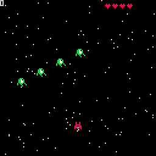

# 15. Stars

<video controls width="512" poster="./tut_15.gif">
    <source src="./tut_15.mp4"
            type="video/mp4">
    Sorry, your browser doesn't support embedded videos.
</video>

[Image](./tut_15.git) ([Original Source](https://ztiromoritz.github.io/pico-8-shooter/gif/tut_15.gif))

Let's add a moving star field. It will help give the illusion that the ship is moving through space!

In `_init`, add a stars table and populate it.

```lua
explosions={}
stars={}
for i=1,128 do
 add(stars,{
  x=rnd(128),
  y=rnd(128),
  s=rnd(2)+1
 })
end
```

Each star has a random `X` and `Y` position and a random speed.

In `update_game`, add a loop to update the stars before the explosions loop.

```lua
for st in all(stars) do
 st.y+=st.s
 if st.y>=128 then
  st.y=0
  st.x=rnd(128)
 end
end
```

We move the stars down the screen at a speed of `st.s` pixels per frame. Once
it goes past the bottom of the screen, we move it back to the top of the screen
and give it a new random `X` position.

Stars do not need to be deleted since we continually reuse them. We will only ever have 128 stars in our table.

In `draw_game`, add a loop to display our stars.

```lua
function draw_game()
 cls()
 for st in all(stars) do
  pset(st.x,st.y,6)
 end

 print(ship.p,6)
```

Hit `ctrl-r` to run the game. You should see a continually moving star field
background!

<div></div>

