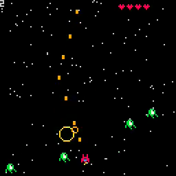

# 16. Enemy Movement and Respawn

<video controls width="512" poster="./tut_16.gif">
    <source src="./tut_16.mp4"
            type="video/mp4">
    Sorry, your browser doesn't support embedded videos.
</video>

[Image](./tut_16.git) ([Original Source](https://ztiromoritz.github.io/pico-8-shooter/gif/tut_16.gif))

The game as it stands now isn't very challenging. There are four enmeies. They
have a very predictable position and movement pattern. Once they are defeated,
no other enemies appear and you are left zooming through a star field with no
other threats.

In this, the final step of the original tutorial, we will add enemy respawn so
that once a wave of enemies is defeated or leaves the screen, another wave
takes their place.

Start by *deleting* the loop that creates the enemies out of `_init`. We are
going to move it elsewhere.

Create a `respawn` function just after `_init`.

```lua
function respawn()
 local n=flr(rnd(9))+2
 for i=1,n do
  local d=-1
  if rnd(1)<0.5 then d=1 end
  add(enemies, {
   sp=17,
   m_x=i*16,
   m_y=-20-i*8,
   d=d,
   x=-32
   y=-32
   r=12,
   box={x1=0,y1=0,x2=7,y2=7}
  })
 end
end
```

In `update_game`, add a check before the enemies loop to call `respawn` if
there are no more enemies. Modify the enemies loop to randomize their movement
patterns a bit and to remove enemies that have left the screen.

```lua
if #enemies<=0 then
 respawn()
end

for e in all(enemies) do
 e.m_y+=1.3
 e.x=e.r*sin(e.d*t/50)+e.m_x
 e.y=e.r*cos(t/50)+e.m_y
 if coll(ship,e) and not ship.emm then
  ship.imm=true
  ship.h-=1
  if ship.h<=0 then
   game_over()
  end
 end

 if e.y>150 then
  del(enemies,e)
 end
end
```

Hit `ctrl-r` to run the game. After defeating all of the enemies on the screen
or allowing them to go passed the ship off the bottom of the screen, more
enemies should take their place. Their movement patterns should be a bit
randomized and you fill finally be able to beat your high score of `4`!

<div></div>

Congratulations! You have completed all of the steps of the original "Space Shooter in 16 GIFs" tutorial!

The fun doesn't have to stop here! There are many things left that you could do. Here are some ideas to get you started.

- Can you move your ship off of the screen? What would it take to prevent this?
- Bullets go straight through enemies. In many shooters, bullets are destroyed
  by the impact with an enemy. How would you implement this?
- In order to restart the game, we have to reset the cart? Write code to prompt
  the user to press a button to restart and then reset the cart for them.
  There's a PICO-8 API to reset the cart. Find the documentation for it!
- Our game has no sound! Create sounds for firing a bullet, being hit, and
  destroying an enemy. Play the sounds at the appropriate times.
- Our game has no music! Write a catchy tune to keep you singing along while
  you save the galaxy from the green invaders.
- All of the enemies can be defeated with a single hit. What would you need to
  change to make it take more than one hit to destroy an enemy?
- We only have one enemy type! How would you add more?
- All of the enemies follow the same movement pattern. What are some other
  movement patterns? How would you implement them?
- None of our enemies shoot bullets at us. How would you implement enemy
  bullets? Should enemy bullets hurt other enemies? Why or why not? How would
  you implement either approach?
- The ship can never regain any hearts. How would you add power ups to allow
  the ship to recover hearts?
- Being able to recover hearts is nice. What other power ups should be in the
  game? What do they do? How long do they last?
- Speaking of power ups, what about upgrading your laser cannon or swapping it
  out for an entirely different type of gun? What should the different weapon
  types be? How do you change them? Do they randomly appear? Do you have to buy
  them in a shop between levels?
- Our game has no levels. How long should a level be? What should change from
  level to level? Enemy speed, strength, type? What about visual changes?
  Colors, obstacles, music?
- Our game has no story. Should it have a general back story you see when you
  first run the game? Or should the story unfold as you progress from level to
  level? How would you implement your choice?
- Even if a game has no story you directly tell the user, having a back story
  for your game makes it easier to design things that fit into the game and
  don't feel out of place. What is the back story for your game? How does that
  story influence how you think about your game?
- We have no high score list. How would you implement one?

