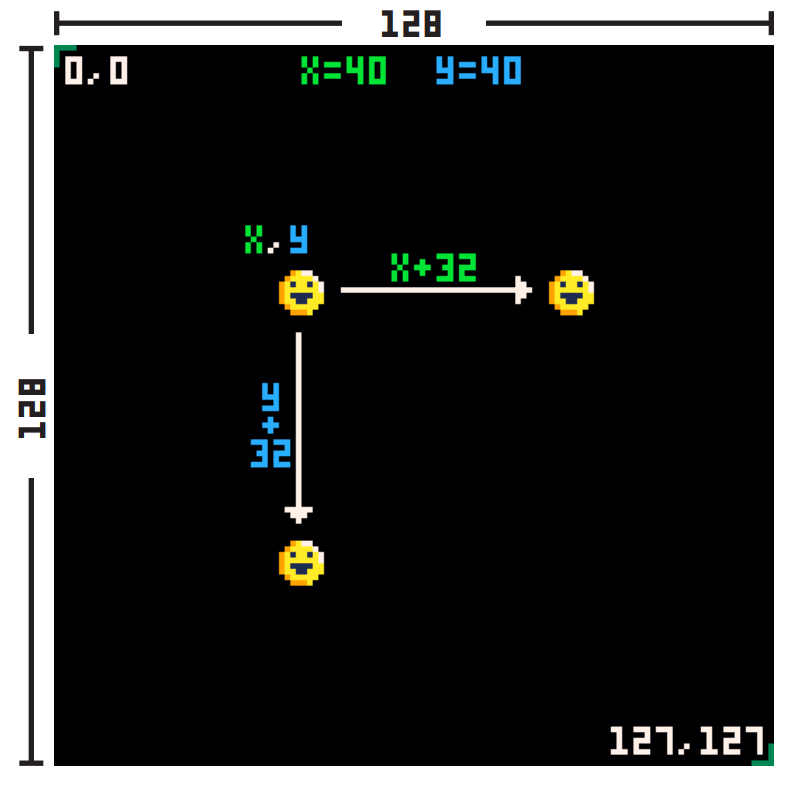

# Coordinates

PICO-8's screen space is 128 pixels wide and 128 pixels tall. This may not seem
like a much at first, but you can do a lot in that amount of space!

Notice the coordinate 0,0 is in the top-left and coordinate 127,127 is in the
bottom-right. This means positive x goes to the right and positive y goes down.
(This may be different from what you're used to, where positive y is usually
up.) Also remember that because we start counting at 0, the position 127 is
actually the 128th pixel.

