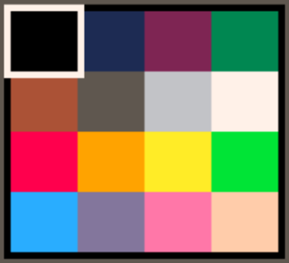

# Limitations and Specifications

## Limitations: A Blessing or a Curse?

As you learn about PICO-8 and the limitations it imposes, you may find yourself
wondering why they were put in place when the vast majority of systems running
PICO-8 would have no problems vastly exceeding its seemingly arbitrary
constraints.

The PICO-8 homepage provides part of the answer:
> The harsh limitations of PICO-8 are carefully chosen to be fun to work with,
> to encourage small but expressive designs, and to give cartridges made with
> PICO-8 their own particular look and feel.

Constraints inspire and enable creativity. Every decision PICO-8 takes away
from you is one fewer you have to worry about. All of that energy can then be
turned to working within those constraints to create something amazing.

## Specifications

| *Specification* | *Description* |
|-----------------|---------------|
| Resolution      | 128x128 |
| Palette         | 16 fixed colors |
| Sound           | 4 Channel Synth |
| Language        | Lua |
| Cartridge Size  | 32k (64k with limitations) |
| Sprites         | Up to 256 8x8 sprites |
| Map             | Up to 128x32 cells |
| Tokens          | 8192 |
| Input           | 4 directions, 2 buttons |
| Extended Input  | Mouse, if in devkit mode |

## Palette

PICO-8 uses a fixed color palette. You are restricted to these colors. This
saves you from having to agonize over whether you have found the right shade of
blue for your character or background or other game element. The limited number of choices accelerates your development flow.

The table on this page comes from [lospec](https://lospec.com/palette-list/pico-8). If you are just using the PICO-8 environment, you will never need to know the RGB values for each of these colors. For those looking to expand their use of the palette beyond that, this reference may be useful.

  

    #000000
  

  

    #1D2B53
  

  

    #7E2553
  

  

    #008751
  

  

    #AB5236
  

  

    #5F574F
  

  

    #C2C3C7
  

  

    #FFF1E8
  

  

    #FF004D
  

  

    #FFA300
  

  

    #FFEC27
  

  

    #00E436
  

  

    #29ADFF
  

  

    #83769C
  

  

    #FF77A8
  

  

    #FFCCAA
  

A secret second palette was added in later versions of PICO-8. Accessing it
isn't all that straight forward and there are some limitations on its use. It
is mentioned here to note its existence, but you may want to wait until you are
comfortable developing carts before seeking out the details.

## Tokens

One of PICO-8's limits is how much code you can use. This limit is a bit hard
to understand for people new to PICO-8.  It's based on something called tokens.
These are basically individual bits of code.  For example, something like
`x=width+7` takes up five tokens, one token for each part (`x`, `=`, `width`,
`+`, and `7`). You are allowed 8192 tokens of code, so you'll be fine until
you're making a fairly large game. You can see the number of tokens you've used
in the bottom-right of the code editor.

