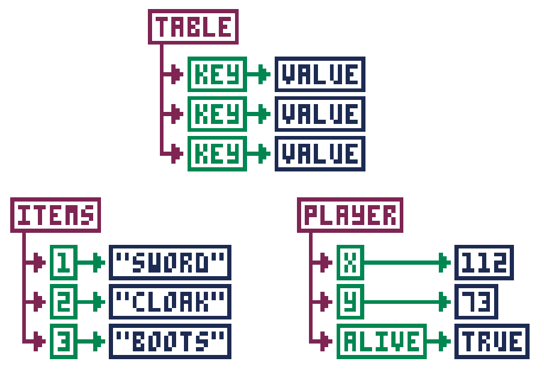

# Programming Basics

This will not be a full introduction to programming, but it will hit on a few
particularly important items.  Even if you don't know much about programming,
you'll be able to follow along if you just understand these few things. If know
programming already, you can skip all this stuff.

## Variables

Variables are ways to store information with an easy-to-remember name. As the
name "variable" implies, the information stored in the variable can vary, or
change. In PICO-8, variables can hold numbers, text, and the value true or
false. Here are a few examples of variables:

```lua
x=64
name="dylan"
alive=true
```

Some words are reserved and you can't use them for variable names (like the
word `function`).  You also can't start the name of a variable with a number.

## Functions

Functions are a list of instructions for the computer that are all grouped
together under one name. Functions are usually created if you have a certain
set of actions you want the computer to do many different times.

Functions are written with parentheses after the name of the function. This is
so you can give the function extra information in case it needs that extra
information to do its job. Even if no extra information is needed, you still
need to write the parentheses.

Here's an example function called `draw_target()`. It draws a target shape
using filled circles. Note that it needs an X and a Y coordinate to do its job:

```lua
function draw_target(x,y)
 circfill(x,y,16,8)
 circfill(x,y,12,7)
 circfill(x,y,8,8)
 circfill(x,y,7,7)
end
```

Maybe you noticed something: `circfill()` is a function too! It's a function
built into PICO-8, so you don't have to write the steps yourself, but it's
still a function. You give it an X/Y coordinate, a radius, and a color, and it
draws a filled circle at X/Y, at that radius, and with that color. And
`circlfill()` is just one of many built-in functions!

Usually a function just does the job you need it to do and that's that, like
the `draw_target()` function above, or `circlfill()`. But sometimes you need a
function to give back, or return, information when it's done doing all of its
steps.

Say you make a function that does a bunch of math, but you want to know the
result when it's done. In other words, you want it to return the result back to
you. Easy enough. You just use `return` and then specify what you want it to
return.

Here's a real example:
```lua
function area(width,height)
 return width * height
end

w=8
h=5
if (area(w,h) > 25) then
 print("big!")
end
```

When that function gets run, the number returned would be `40`. Since `40` is
indeed greater than `25`, the `print()` function would then happen.

Functions are the backbone of anything you will create in PICO-8. Most games
are really just many, many functions strung together, each one making changes
to things in the game as the players play.  Really understanding how your code
moves from one function to another is the key to being able to make great
games.

## Tables

Tables are a way to store a lot of information all together under one variable
name. Most PICO-8 games will use a table at some point or another, so it's good
to understand how they work.

When you add a piece of information, or **value**, to a table, it gets paired
with a name or a number called a **key**. The key is what you use to get the
information back out of the table. You can say, "Look up the information stored
in **that** table using **this** key." Keys are like the index in a book.

If you add values to a table without setting the key, the key will
automatically be assigned as a number.  Let's see an example of what this looks
like.



Now let's see how that looks in code. Take note how we create the player table
using empty curly braces. Then we add the values with named keys.

For the items table, we create the table with the values inside the curly
braces, but without names.  The keys get automatically assigned as numbers.

```lua
player={}
player.x=112
player.y=73
player.alive=true
items={"sword","cloak","boots"}
```

That's how to get values into a table. But what about getting values back out?
For keys that are names, you can just use `table.key`, such as `player.x` or
`player.alive`. But for keys that are numbers, you use square brackets with the
number of the key inside, such as `items[1]` or `items[3]`.

If your table uses numbers for keys, you can find out how many values are
stored in a table by using the number sign (#), such as `#items`. In our
example, this would give you `3`. This is useful if you have to loop through
all the values in a table and do something with each value. Here's an example:

```lua
for i=1,#items do
 print(items[i])
end
```

This starts `i` at `1` and counts to `#items` (which is `3`).
Each time, it will print the value at `items[i]`. Since
`i` goes from `1` to `3`, every item will be printed.

