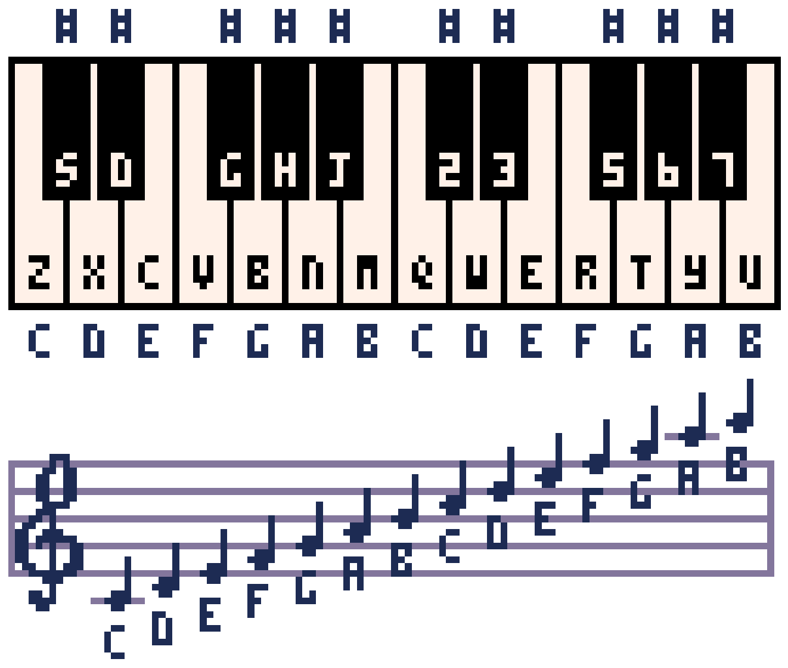

# Sound Editor

A PICO-8 cart can have up to 64 sounds. Each sound has 32 notes. You can
control the frequency, instrument, volume, and effect for each note.

You can also change the playback speed of the whole sound and make sections of
it loop. The Sound Editor has two modes: pitch mode and tracker mode. Pitch
mode is useful for simple sound effects, whereas tracker mode is useful for
music. Below is a PICO-8 music reference to use for tracker mode.

## Shortcuts

- **Space** - Play/stop
- **- / +** - Go to previous/next sound
- **< / >** - Change the speed of the current sound
- **Shift-Space** - Play the current group of 8 notes
- **Shift-Click** on an instrument, effect, or volume to change all notes in a
  sound at once
- **Ctrl-Up/Ctrl-Down**, **PgUp/PgDn** - Move up/down 4 notes at a time
  (tracker mode only)
- **Ctrl-Left/Ctrl-Right** - Switch columns (tracker mode only)

(Use Cmd instead of Ctrl on macOS.)
